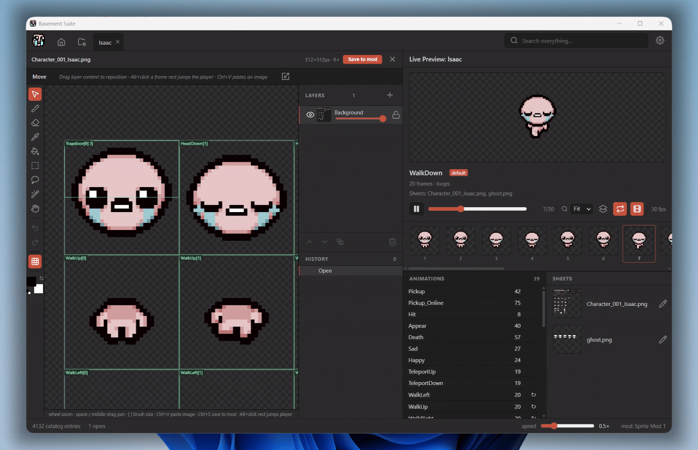
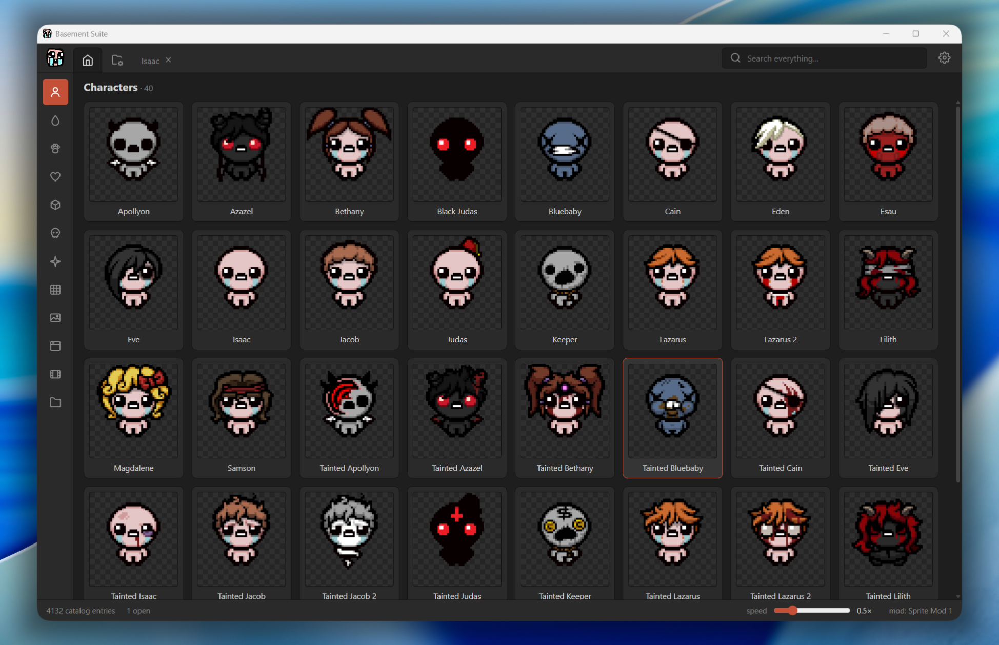
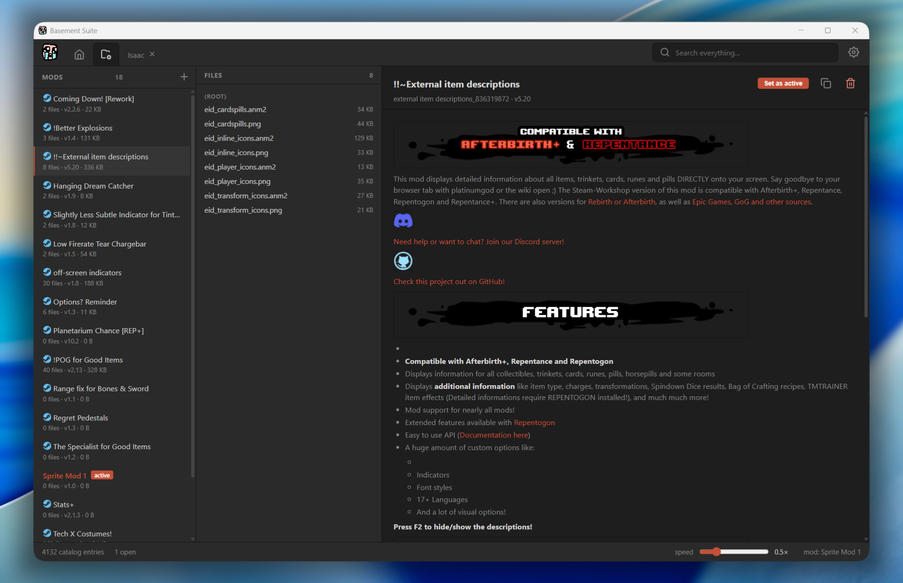
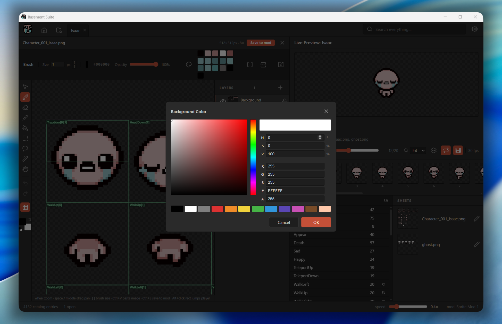
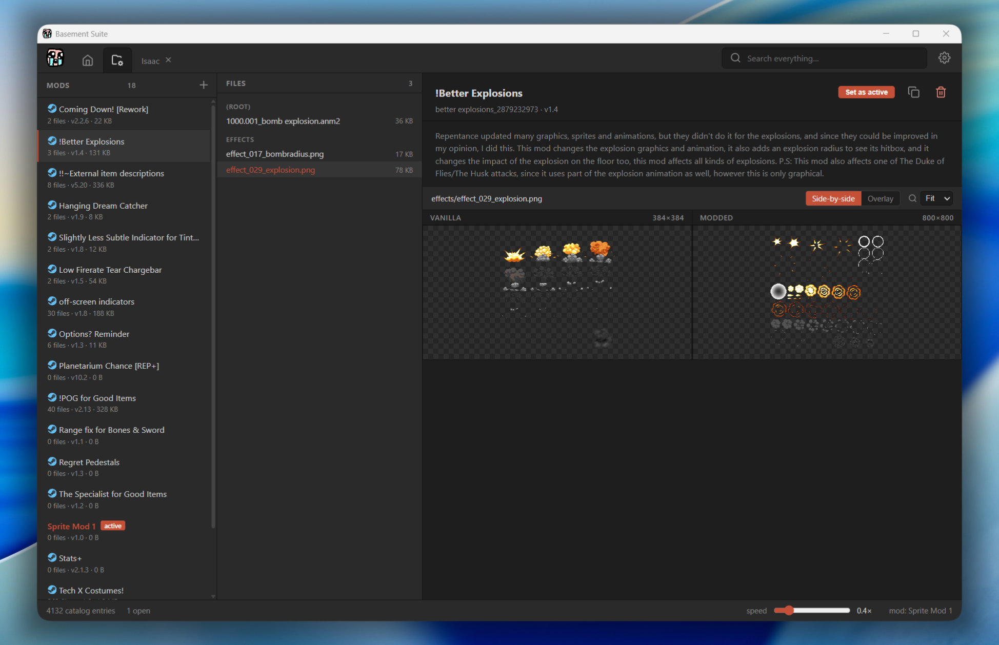

# Basement Suite

A desktop **Photoshop-for-Isaac** — a multi-layer pixel-art editor and a live `.anm2` animation previewer, side by side. Paint into a sprite layer in one pane, watch the animation re-render in the other, and save straight into a mod folder. Built specifically to make sprite modding for *The Binding of Isaac: Repentance* less painful.

## What it does

**Browse the game by name, not by file path.** A semantic catalog reads the game's own XML (`entities2.xml`, `items.xml`, `players.xml`, `costumes2.xml`) and turns the 8,000+ extracted PNGs and 2,000+ anm2 files into a navigable grid of characters, enemies, items, familiars, pickups, effects, UI, and cutscenes. Rendered hover-animated thumbnails so you can see what something looks like before opening it.

**Live preview while you edit.** Click any sprite to open it in a document tab. The right pane plays the actual animation (with body + head + costume composited the way the game does it). The left pane is the editor. Strokes appear in the preview *during* the gesture, not on save.

**Photoshop-style editor:**
- Multi-layer documents (visible / opacity / lock / rename / reorder by drag), composite is what the game sees
- **Tools:** Move (V), Brush (B), Eraser (E), Eyedropper (I), Fill bucket (G), Rectangle marquee (M), Lasso (L), Magic wand (W), Pan (H)
- **Selections** clip paint, support inside-drag (Photoshop's "move marquee" gesture), Free Transform (Ctrl+T), Cut (Ctrl+X), Delete, Alt+drag to duplicate, Ctrl+D to deselect
- **Free Transform** with corner *and* edge handles — uniform scale on corners, axis-locked on edges
- **Mirror brush** (horizontal / vertical / both) for symmetric sprites
- **Frame strip** under the preview shows every frame of the current animation as a clickable thumbnail; click one to jump the editor's pan to the matching crop rect
- **Layers + History panels** docked beside the canvas (Photoshop layout); every operation lands in the History panel with a label, click any row to jump to that state
- **Merge down** (Ctrl+E), **drag-to-reorder layers**, **per-layer opacity slider** that lands as a single history entry on release

**Mod manager** (separate tab):
- Lists every folder under `modsPath` with parsed `metadata.xml`, version, file count, and a Steam Workshop badge when the mod has a workshop `<id>`
- **Active mod** — one mod at a time receives saves and overlays into the preview so modded sprites appear live
- **Diff viewer** — side-by-side or overlay-slider comparison of any modded file against vanilla
- **New mod** creation, hard-delete with confirm, BBCode-rendered descriptions (including remote images)
- Dirty-state modal stops you closing a tab or switching active mods over unsaved edits

**Mod export:** Ctrl+S in the editor writes the flattened sprite into `<modsPath>/<name>/resources/gfx/<mirrored path>/...` and generates `metadata.xml` on first save. Your game files are never touched.

## Screenshots



| Catalog browser | Mod manager |
| --- | --- |
|  |  |

| Color picker | Diff viewer |
| --- | --- |
|  |  |

## Acknowledgments

Massive thanks to **Edmund McMillen, Nicalis, and the entire team behind The Binding of Isaac: Rebirth, Afterbirth, Afterbirth+, Repentance, and Repentance+.** This project exists because the game has thirteen years of incredible art and the existing tools for modifying that art are genuinely difficult to work with. Basement Suite is a labor of love, built specifically to make sprite modding accessible — none of it would exist without the world they made.

This app reads only data the game's own resource extractor produces locally; it does not bundle, redistribute, or modify any of the game's assets.

## Setup

### Step 1 — Own *The Binding of Isaac: Repentance* on Steam

Repentance / Repentance+ DLC is recommended for the full asset tree. Basement Suite browses *your* installed game; without it, there is nothing to load.

### Step 2 — Extract the game's resources

Repentance keeps its art packed inside `.a` archive files that no normal program can read. The game ships with an official extractor that unpacks everything into a real folder. **Run it once.**

1. Open Steam → right-click *The Binding of Isaac: Rebirth* → **Manage → Browse local files**.
2. Open `tools\ResourceExtractor\` inside that folder.
3. **Right-click `ResourceExtractor.exe` → Run as administrator** *(important — it writes back into the game directory and will silently do nothing otherwise).*
4. Click *Extract resources*. Takes a couple of minutes the first time.
5. When it finishes you'll have a new folder: `<game folder>\extracted_resources\resources\` with thousands of PNGs and `.anm2` files under `gfx\`. That's what Basement Suite reads.

### Step 3 — Install Basement Suite

Download the latest installer from the **[Releases page](https://github.com/laughable-9/basement-suite/releases)** and run it. Two installers are attached to every release — pick whichever you prefer:

- `Basement.Suite_<version>_x64-setup.exe` — NSIS installer (smaller, easier to uninstall)
- `Basement.Suite_<version>_x64_en-US.msi` — MSI installer (good for enterprise / managed Windows)

The installer is **unsigned**, so Windows SmartScreen will warn *"Windows protected your PC"* on first run. Click **More info → Run anyway** to proceed.

> macOS / Linux installers aren't published yet — see *Building from source* at the bottom of this README if you're on a non-Windows platform.

### Step 4 — Point Basement Suite at your folders

Launch *Basement Suite* from the Start menu. The first time it opens you'll see a setup form with three folder fields. Click **Browse** next to each and pick the right folder:

| Field | What to pick |
| --- | --- |
| Isaac install folder | The folder Steam opened in Step 2 (the one with `isaac-ng.exe`). |
| Mods folder | The `mods` subfolder inside the Isaac folder. |
| Extracted resources folder | The `resources` folder you got in Step 2 (`<Isaac folder>\extracted_resources\resources`). |

Hit **Save and continue**. Your choices are stored in `%APPDATA%\dev.kyle.basement-suite\bs.config.json` so you only do this once — change them later via the gear icon at the top-right.

That's it. The Home tab populates as the catalog finishes building (~5 seconds on first launch).

### Troubleshooting

- **"Windows protected your PC" SmartScreen warning** — expected; the installer isn't signed. Click *More info → Run anyway*.
- **Empty Home tab** — the `Extracted resources folder` is wrong, or the extractor was never run. Open Settings (gear icon), point at `<Isaac folder>\extracted_resources\resources`, hit Save.
- **Setup form shows "does not exist on disk"** — the path you typed isn't a real folder. Use the Browse button to pick it instead of typing.
- **Characters render as blank silhouettes** — the catalog loaded but spritesheet PNGs can't be found. Confirm `extracted_resources/resources` contains a `gfx/` folder; if not, re-run the resource extractor as administrator.

## Tech

Tauri 2 · React · TypeScript · Vite · Canvas 2D. The Rust side is a thin, capability-scoped file I/O shell (`fs` plugin, `dialog` plugin); everything else is TypeScript. The anm2 parser is pure, lenient by design, and unit-tested against the entire shipped game corpus (2,199 files, every landmine documented in `SCAN_REPORT.md`).

## Asset policy

This repo contains **no game assets**. Spritesheets and `.anm2` files are copyrighted; the app and its tests read them from your local game installation at runtime. The game directory is treated as **strictly read-only** — every write call routes through `lib/fsx/modWrite.ts` and is rejected unless the target lives under `modsPath`.

## Support the project

If Basement Suite has saved you time on a mod and you'd like to throw a tip in the jar:

[](https://ko-fi.com/laughable)

## Building from source

For non-Windows users, or anyone who wants to contribute. You'll need [Node.js 20+](https://nodejs.org/), [Rust](https://rustup.rs/), and your platform's native build tools (on Windows: Visual Studio Build Tools with the C++ workload; on macOS: `xcode-select --install`; on Debian/Ubuntu: `sudo apt install libwebkit2gtk-4.1-dev build-essential libxdo-dev libssl-dev librsvg2-dev`).

```bash
git clone https://github.com/laughable-9/basement-suite.git
cd basement-suite
npm install
npm run tauri dev        # desktop window with hot-reload
```

The first Rust compile takes 5–10 minutes (downloads ~400 crates); subsequent runs are seconds. `npm run tauri build` produces a packaged installer in `src-tauri/target/release/bundle/`. `npm test` runs the 93-test vitest suite.

In dev mode the app reads `bs.config.json` from the repo root as a fallback, so you don't have to migrate your config to AppData while iterating.

## License

[MIT](LICENSE) — covers the code in this repository only, not any game content it reads.
